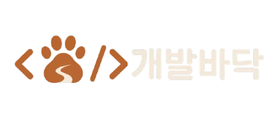
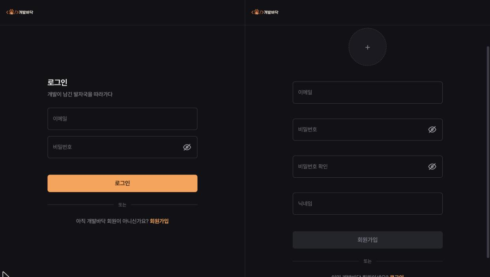
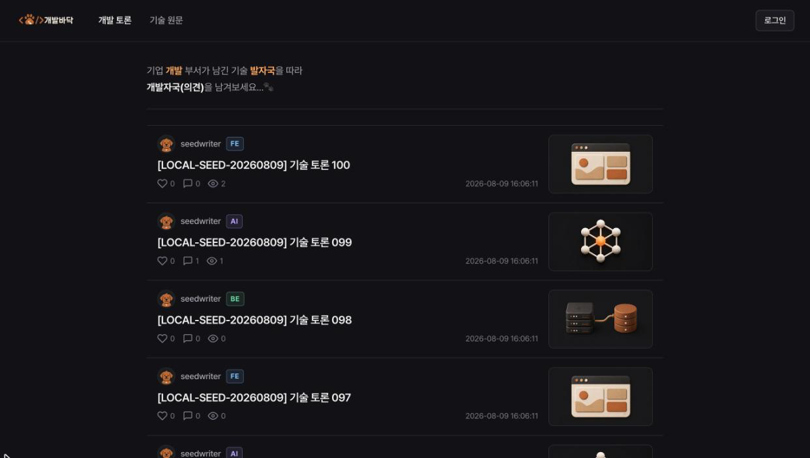
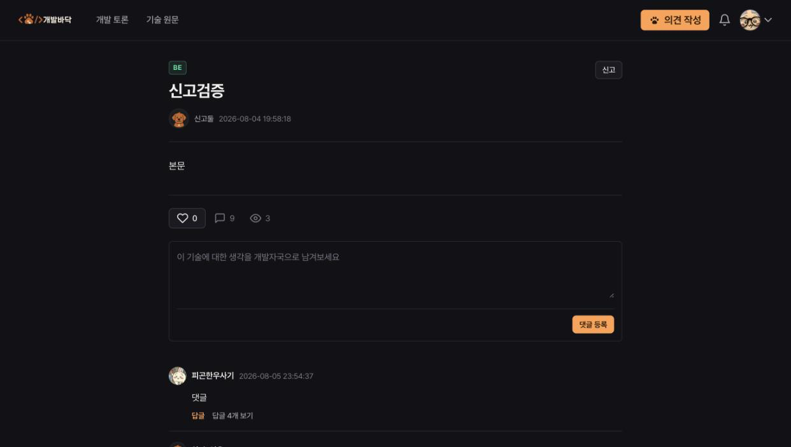
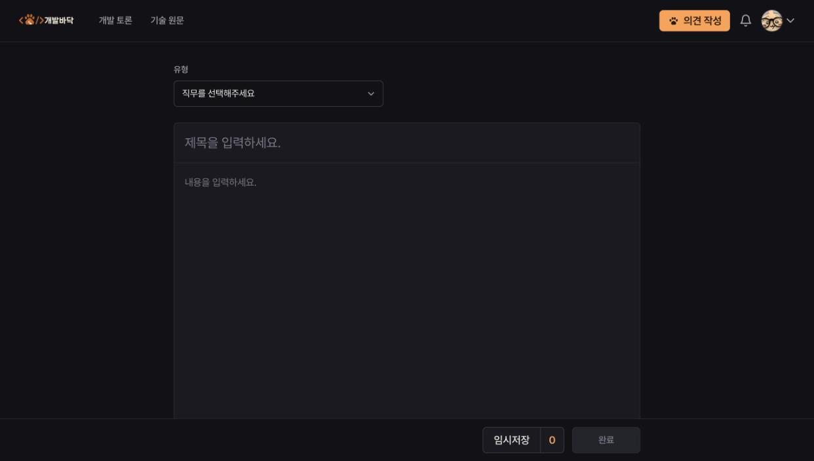
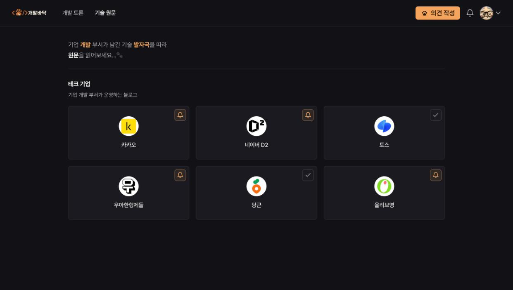
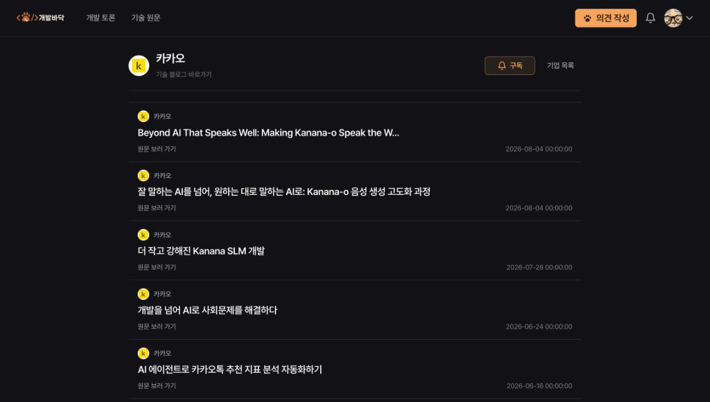
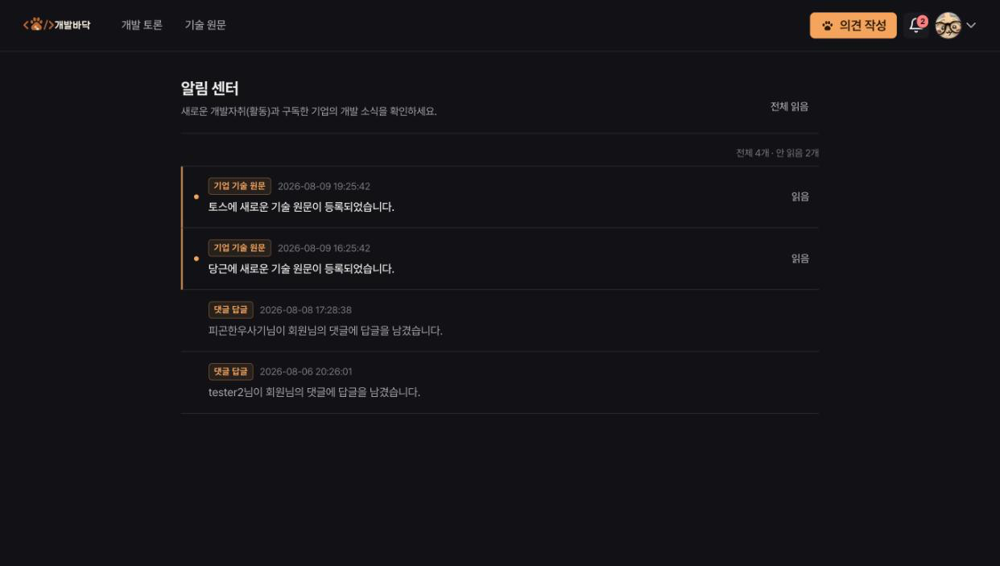
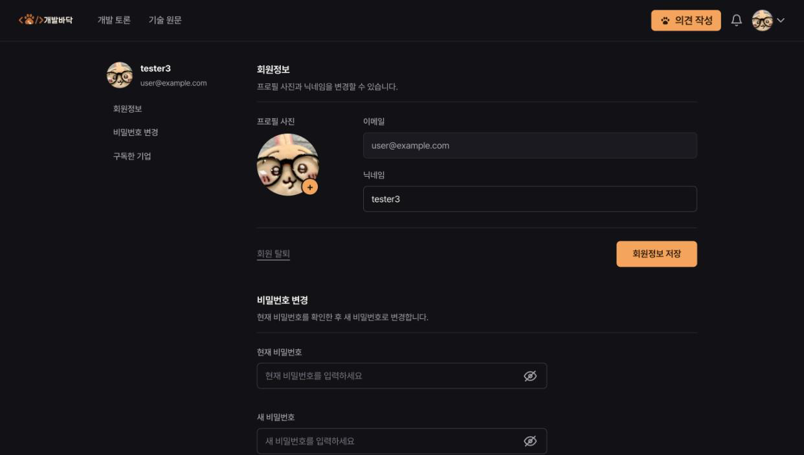

<p align="center">
  
</p>

## 프로젝트 설명

> 여러 기업 기술 블로그 글을 한 곳에서 발견하고, 서비스 이용자들끼리 기술에 대한 생각/의견을 다른 이용자들과 나누는 기술 콘텐츠 커뮤니티

- 서비스명: 개발바닥 🐾
- 기술 콘텐츠 게시판명: 개발자국
- 슬로건: 기업 기술팀이 남긴 발자국을 따라가다

기업 기술 블로그의 원문과 개발자들의 의견을 한곳에서 탐색하는 커뮤니티 서비스 **개발바닥**의 프론트엔드 레파지토리입니다.

이 저장소는 화면 렌더링과 사용자 상호작용, 인증 상태, REST API 및 SSE 연동을 담당합니다. 게시글·댓글 중심의 개발 토론과 기업 기술 원문 탐색, 기업 구독 및 실시간 알림 흐름을 React 기반으로 제공합니다.

## 프로젝트 개요

| 항목          | 내용                                                                                                 |
| ------------- | ---------------------------------------------------------------------------------------------------- |
| 기간          | 2026.05.26 ~ 2026.08.09, 약 11주                                                                     |
| 인원          | 1인 프로젝트                                                                                         |
| 담당 범위     | React 프론트엔드, Spring Boot 백엔드, 데이터베이스, Docker·Nginx, AWS EC2, CI/CD                     |
| 프로젝트 성격 | 교육 과정 개인 과제에서 출발해 실제 배포와 운영 환경의 문제 해결까지 확장한 학습·포트폴리오 프로젝트 |

회원, 게시글, 댓글, 좋아요, 기술 아티클 수집, 기업 구독, 실시간 알림을 추가하며 기술 콘텐츠를 중심으로 의견을 나누는 서비스로 고도화했습니다. EC2에 직접 배포 진행했습니다.

## 주요 기능

| 영역          | 제공 기능                                                              |
| ------------- | ---------------------------------------------------------------------- |
| 개발 토론     | 게시글 무한 스크롤, 상세 조회, 작성·수정·삭제, 좋아요, 신고, 임시 저장 |
| 댓글과 답글   | 댓글·답글 작성, 수정, 삭제 및 작성자 기준 액션 제어                    |
| 기술 원문     | 기업 목록 조회, 기업별 기술 아티클 무한 스크롤, 원문 링크 이동         |
| 기업 구독     | 기업 구독·해지, 비활성 기업 상태 반영, 마이페이지 구독 목록            |
| 알림 센터     | 읽지 않은 알림 수, 목록 페이징, 개별·전체 읽음 처리, SSE 기반 갱신     |
| 회원과 프로필 | 회원가입, 로그인·로그아웃, 세션 복원, 프로필·비밀번호 변경, 회원 탈퇴  |

## 서비스 화면

스크린샷은 `docs/screenshots/`에 있으며 모두 데스크톱 1242px 너비에서 동일한 조건으로 촬영했습니다. 마이페이지 캡처의 이메일은 예시 값으로 가렸습니다.

| 페이지          | 경로                                | 스크린샷                                                                                            | 확인할 기능                             |
| --------------- | ----------------------------------- | --------------------------------------------------------------------------------------------------- | --------------------------------------- |
| 로그인·회원가입 | `/users/login`, `/users/signup`     |          | 입력 검증, 프로필 이미지, 인증 화면     |
| 개발 토론 목록  | `/posts`                            |           | 카테고리, 게시글 메타 정보, 무한 스크롤 |
| 게시글 상세     | `/posts/:postId`                    |         | 좋아요, 댓글·답글, 작성자 액션          |
| 게시글 작성     | `/posts/write`                      |          | 카테고리 선택, 임시 저장, 게시글 발행   |
| 기술 기업       | `/tech-enterprises`                 |      | 기업 카탈로그와 구독 버튼               |
| 기술 원문 목록  | `/tech-enterprises/:enterpriseSlug` |  | 기업 정보, 구독 상태, 원문 무한 스크롤  |
| 알림 센터       | `/notifications`                    |         | 읽지 않은 알림, 개별·전체 읽음 처리     |
| 마이페이지      | `/users/myInfo`                     |              | 프로필·비밀번호 설정, 구독 기업 관리    |

## 기술 스택

| 구분   | 기술                                  |
| ------ | ------------------------------------- |
| 런타임 | Node.js 20.19.0                       |
| UI     | React 19, JavaScript, JSX             |
| 라우팅 | React Router 7                        |
| 스타일 | Tailwind CSS 4, Pretendard            |
| 통신   | Fetch API, EventSource                |
| 빌드   | Vite 8, npm                           |
| 품질   | ESLint 10, Prettier 3, GitHub Actions |
| 배포   | Docker, Nginx, GHCR                   |

## 기술 선택 배경

기술을 많이 도입하는 것보다 현재 문제를 해결하는 데 필요한 범위를 먼저 판단했습니다. 아래 내용은 실제로 검토한 선택지와 감수한 trade-off를 기준으로 작성했습니다.

### React + Vite — DOM 중심 SPA를 상태 중심 구조로 전환

처음에 JS의 구동 방식을 제대로 익히고자 Vanilla JavaScript를 SPA 구조를 대입하여 구현을 시작했습니다. 추후 VDOM을 적용해보면서 React의 동작 방식을 익혔고, 최종 구조로는 React로 마이그레이션했습니다.

**문제**

기존 Vanilla JavaScript SPA에서는 URL 변경, DOM 교체, 이벤트 등록, 상태와 화면의 동기화를 직접 관리했습니다. 페이지 파일 하나가 API 호출과 이벤트 처리, DOM 변경을 함께 담당했고, 좋아요 같은 상태가 DOM 속성이나 텍스트에 저장되기도 했습니다. 기능이 늘수록 상태의 소유 위치와 변경 경로를 추적하기 어려워졌습니다.

**선택과 이유**

React로 마이그레이션해 상태를 DOM이 아닌 컴포넌트와 커스텀 훅이 소유하도록 바꿨습니다. 인증도 단순 boolean 대신 `checking`, `authenticated`, `unauthenticated`로 구분해 세션 복원 중 잘못된 리다이렉트와 화면 깜빡임을 줄였습니다. 서버 렌더링보다 CSR 기반 SPA가 중심이었기 때문에 Next.js까지 새로 도입하지 않았습니다.

Vite는 Vanilla JavaScript 단계부터 개발 서버와 API 프록시로 사용하고 있었습니다. React 전환 이후에도 빠른 개발 서버, `/api` 프록시, 정적 빌드라는 요구를 모두 충족했기 때문에 설정을 유지했습니다.

**Trade-off와 구현 근거**

React 전환으로 컴포넌트 생명주기와 비동기 경쟁 상태를 직접 관리해야 하는 비용이 생겼습니다. 이를 feature 훅, `AbortController`, 요청 잠금으로 분리했습니다. 현재 구조는 [`main.jsx`](./src/main.jsx), [`AuthProvider.jsx`](./src/shared/routes/AuthProvider.jsx), [`vite.config.js`](./vite.config.js)에서 확인할 수 있습니다.

### Tailwind CSS — CSS+BEM보다 일관된 UI 규칙을 우선

**문제**

기존 CSS와 BEM 구조에서는 공통 스타일과 페이지별 스타일이 여러 파일에 나뉘어 있어, 같은 역할의 색상·간격·상태 표현이 화면마다 달라질 가능성이 있었습니다.

**선택과 이유**

React 마이그레이션 과정에서 기존 CSS+BEM을 유지하는 대신 Tailwind CSS를 전면 도입했습니다. CSS Modules나 styled-components와의 추상적인 비교보다 실제 코드베이스를 그대로 유지할지, 정해진 유틸리티 규칙으로 다시 작성할지를 판단했습니다. 선택 기준은 다음 순서였습니다.

1. 화면 전반의 스타일 규칙과 일관성
2. JSX에서 스타일을 함께 확인하며 빠르게 구현·수정하는 흐름
3. 색상·간격·폰트 등 디자인 토큰 관리
4. 반응형과 `hover`, `focus-visible`, `disabled` 상태 작성의 편의성

**Trade-off와 구현 근거**

유틸리티 클래스가 JSX에 길게 노출되는 비용을 감수하는 대신, 반복되는 버튼·폼·상태 표현은 `app-*` 공통 클래스로 묶고 브랜드 색상과 표면·타이포그래피는 Tailwind theme token으로 관리했습니다. 실제 규칙은 [`main.css`](./src/styles/main.css)에서 확인할 수 있습니다.

### Context + 커스텀 훅 — 상태의 수명과 공유 범위에 맞춘 소유권

**문제**

모든 상태를 전역 저장소에 올리면 접근은 쉬워지지만, 특정 화면에서만 사용하는 서버 데이터까지 애플리케이션 전체의 상태가 됩니다. 반대로 인증과 알림 신호를 페이지마다 관리하면 라우트 이동 시 상태와 연결이 끊어집니다.

**선택과 이유**

라이브러리를 먼저 추가하지 않고 상태가 필요한 범위와 유지되어야 하는 시간을 기준으로 소유 위치를 정했습니다.

- 인증 상태는 라우트 가드와 여러 화면이 사용하므로 `AuthProvider`가 관리합니다.
- SSE 연결과 읽지 않은 알림 수, 동기화 신호는 로그인 세션 동안 유지되어야 하므로 `NotificationProvider`가 관리합니다.
- 게시글·댓글·프로필·알림 목록처럼 특정 화면에서 소비하는 데이터는 페이지 또는 feature 훅이 관리합니다.

전역 공유 상태가 인증과 알림으로 제한되어 있어 Redux는 구체적인 도입 후보로 두지 않았습니다. TanStack Query와 SWR은 검토했지만, 현재 규모에서는 커스텀 훅과 필요한 시점의 명시적 재조회로 요구사항을 충족할 수 있다고 판단했습니다.

**Trade-off와 구현 근거**

서버 캐시 라이브러리를 사용하지 않아 loading·error·요청 취소·재조회 코드를 직접 관리해야 합니다. 대신 임시저장처럼 외부 변경 가능성이 낮은 데이터는 불필요한 자동 재검증 없이 사용 시점에 조회하고, 상태의 변경 경로를 feature 안에서 명시적으로 추적할 수 있습니다. 여러 화면에서 동일 서버 상태의 캐싱과 재검증이 반복적으로 필요해지면 TanStack Query를 검토할 수 있지만 현재 확정된 도입 계획은 아닙니다.

### SSE — 단방향 알림에 필요한 통신만 유지

**문제**

알림은 서버에서 클라이언트로 변경 사실을 전달하면 되는 단방향 흐름이었습니다. 클라이언트가 주기적으로 새 알림을 확인하는 polling은 변경이 없어도 요청을 만들고, 양방향 메시징을 위한 WebSocket은 일주일보다 짧은 구현 일정과 현재 요구에 비해 관리 범위가 컸습니다.

**선택과 이유**

Spring Boot와 React에서 단방향 연결을 비교적 단순하게 구성할 수 있는 SSE를 선택했습니다. 프론트엔드와 백엔드를 함께 담당했기 때문에 완성된 API를 소비하는 데 그치지 않고, 알림 DB 저장부터 트랜잭션 커밋 이후 신호 전송, 이벤트 계약, heartbeat, 연결 정리, 재연결 후 REST 동기화까지 전체 흐름을 설계했습니다.

**Trade-off와 구현 근거**

지속 연결은 timeout·heartbeat·서버 emitter 정리·네트워크 재연결·중복 이벤트 처리가 필요합니다. 프론트엔드는 페이지 이동과 관계없이 로그인 세션 동안 연결을 유지하고, SSE를 데이터 원본이 아닌 재조회 신호로 사용합니다. 인증 실패 재연결, 이벤트 ID 중복 제거, 150ms 단위 동기화는 [`useNotificationStream.js`](./src/features/notification/hook/useNotificationStream.js)에 구현되어 있습니다.

### JWT 인증 — 메모리 토큰과 HttpOnly cookie의 역할 분리

**문제**

액세스 토큰을 `localStorage`에 저장하면 JavaScript에서 지속적으로 접근할 수 있어 XSS 발생 시 토큰 자체가 탈취될 위험이 있습니다. 반면 메모리에만 저장하면 새로고침 때 액세스 토큰과 인증 상태가 사라집니다.

**선택과 이유**

액세스 토큰은 JavaScript 메모리에만 보관하고, refresh token은 프론트엔드 코드가 직접 읽을 수 없는 HttpOnly cookie로 관리하도록 직접 설계했습니다. 애플리케이션 초기화, 액세스 토큰 만료 임박, 인증 요청의 `401` 응답으로 재발급 시점을 제한했습니다.

**Trade-off와 구현 근거**

XSS에 대한 토큰 노출 범위를 줄이는 대신 새로고침마다 인증 복구 요청이 필요합니다. 여러 요청이 동시에 재발급을 시도할 때는 하나의 `refreshPromise`를 공유해 중복 호출을 막았습니다. 쿠키가 필요한 로그인·재발급·로그아웃 요청은 `credentials: 'include'`를 사용하고 브라우저 네트워크 탭에서 전달과 삭제를 확인했습니다. 관련 흐름은 [`authApi.js`](./src/features/auth/api/authApi.js), [`tokenManager.js`](./src/shared/api/tokenManager.js), [`http.js`](./src/shared/api/http.js)로 이어집니다.

### Docker + Nginx + GitHub Actions — 빌드와 실행 책임 분리

**문제**

초기 배포는 EC2에 SSH로 접속해 코드를 받고 서버에서 Gradle과 npm 빌드를 직접 수행했습니다. 배포 과정이 사람의 명령 실행에 의존했고, 소형 EC2가 애플리케이션 실행뿐 아니라 빌드 부하까지 담당했습니다. 프론트엔드 배포가 Compose 의존성을 따라 백엔드 컨테이너까지 재생성할 가능성도 있었습니다.

**선택과 이유**

- Docker로 로컬과 배포 서버의 실행 환경 차이를 줄이고 동일 이미지로 반복 배포할 수 있게 했습니다.
- 멀티 스테이지 빌드에서 Node.js와 Vite는 `dist/` 생성에만 사용하고, 최종 이미지에는 Nginx와 정적 파일만 남겼습니다.
- Nginx를 정적 파일 서버이자 단일 진입점으로 두어 SPA fallback, `/api`·`/uploads` 프록시, 정적 자산 캐시 정책을 함께 관리했습니다.
- GitHub Actions가 포맷·린트·빌드, 이미지 생성, GHCR push를 담당하고 EC2는 완성된 이미지를 내려받아 실행하도록 책임을 나눴습니다.

**Trade-off와 구현 근거**

이미지 레지스트리, 배포 secret, Compose와 저장소 간 계약을 함께 관리해야 하는 복잡성이 추가됐습니다. 대신 프론트엔드·백엔드·인프라 저장소가 각자 자신의 서비스를 배포하고, 프론트엔드는 `--no-deps`로 자기 컨테이너만 교체해 영향 범위를 제한합니다. 구성은 [`Dockerfile`](./Dockerfile), [`nginx.conf`](./nginx.conf), [CD 워크플로](./.github/workflows/cd.yml)에서 확인할 수 있습니다.

## 시작하기

### 요구 사항

- Node.js `20.19.0` (`.nvmrc`와 `package.json`에서 동일하게 고정)
- npm
- API 기능을 사용하려면 `http://localhost:8080`에서 실행 중인 [개발바닥 백엔드](https://github.com/100-hours-a-week/KTB4_Hennie_BE)

### 설치 및 실행

저장소를 내려받고 프로젝트 루트에서 다음 명령을 실행합니다.

```bash
git clone https://github.com/100-hours-a-week/KTB4_Hennie_FE.git
cd KTB4_Hennie_FE
nvm use
npm ci
npm run dev
```

개발 서버는 Vite 기본 주소인 `http://localhost:5173`에서 열립니다.

### 환경 설정과 API 프록시

현재 프론트엔드는 `VITE_*` 환경 변수를 사용하지 않으므로 별도의 `.env` 파일이 필요하지 않습니다. 브라우저에서 보내는 API 요청은 항상 `/api`를 기준으로 합니다.

| 환경        | 프록시 동작                                        |
| ----------- | -------------------------------------------------- |
| 로컬 개발   | Vite가 `/api/*`를 `http://localhost:8080/*`로 전달 |
| 컨테이너    | Nginx가 `/api/*`를 `backend:8080/*`로 전달         |
| 업로드 파일 | Nginx가 `/uploads/*` 경로를 유지해 백엔드로 전달   |

## 주요 라우트

| 경로                                | 화면                              | 접근 조건                      |
| ----------------------------------- | --------------------------------- | ------------------------------ |
| `/`, `/posts`                       | 게시글 목록                       | 공개                           |
| `/posts/:postId`                    | 게시글 상세                       | 공개, 로그인 시 추가 액션 제공 |
| `/tech-enterprises`                 | 기술 기업 목록                    | 공개                           |
| `/tech-enterprises/:enterpriseSlug` | 기업별 기술 원문                  | 공개                           |
| `/users/login`                      | 로그인                            | 비로그인 사용자 전용           |
| `/users/signup`                     | 회원가입                          | 비로그인 사용자 전용           |
| `/posts/write`                      | 게시글 작성                       | 로그인 필요                    |
| `/posts/:postId/edit`               | 게시글 수정                       | 로그인 필요                    |
| `/notifications`                    | 알림 센터                         | 로그인 필요                    |
| `/users/myInfo`                     | 마이페이지                        | 로그인 필요                    |
| `/users/myInfo/password`            | 마이페이지 비밀번호 영역으로 이동 | 로그인 필요                    |

존재하지 않는 경로는 공통 Not Found 화면을 렌더링합니다. 인증 세션을 복원하는 동안에는 라우트 대신 로딩 화면을 표시하며, 보호된 화면의 비로그인 사용자는 로그인 화면으로 이동합니다.

## 프로젝트 구조

```text
src/
├── app/                     # 라우트 테이블과 공통 레이아웃
├── pages/                   # URL 단위 화면 구성과 페이지 상태
├── features/
│   ├── auth/                # 인증 API, 폼 훅, 사용자 정규화
│   ├── posts/               # 게시글·댓글·답글 UI와 도메인 로직
│   ├── profile/             # 회원정보·비밀번호·탈퇴 기능
│   ├── tech/                # 기업·기술 원문·구독 기능
│   └── notification/        # 알림 목록·읽음 처리·SSE 연결
├── shared/
│   ├── api/                 # Fetch 클라이언트와 토큰 생명주기
│   ├── components/          # 헤더, 폼, 모달, 공통 상태 UI
│   ├── hook/                # 공통 React 훅
│   ├── routes/              # Auth/Notification Provider와 라우트 가드
│   └── utils/               # 포맷, 검증, 상수
└── styles/                  # Tailwind 테마와 공통 디자인 토큰
```

화면에서 서버 데이터를 가져오는 기본 흐름은 다음과 같습니다.

```text
URL 또는 사용자 이벤트
→ App 라우트
→ pages의 화면 컴포넌트
→ features의 훅과 API 함수
→ shared/api의 인증-aware HTTP 계층
→ 백엔드 응답
→ 도메인 정규화
→ 페이지 또는 훅 상태
→ 화면 렌더링
```

서버 상태는 기능별 페이지와 훅이 소유합니다. 목록 요청은 `AbortController`로 이전 요청을 정리하고, 게시글과 기술 원문은 `IntersectionObserver`를 이용해 다음 페이지를 불러옵니다. 앱 전역에서는 `AuthProvider`가 사용자 세션을, `NotificationProvider`가 읽지 않은 알림 수와 실시간 동기화 신호를 제공합니다.

## 핵심 구현

| 구현 영역       | 핵심 설계                                                               | 주요 코드                                                                                                                                                           |
| --------------- | ----------------------------------------------------------------------- | ------------------------------------------------------------------------------------------------------------------------------------------------------------------- |
| 인증 세션       | 메모리 액세스 토큰, refresh cookie, single-flight 재발급                | [`AuthProvider.jsx`](./src/shared/routes/AuthProvider.jsx), [`tokenManager.js`](./src/shared/api/tokenManager.js)                                                   |
| 공통 HTTP 계층  | 요청별 인증 모드, Bearer 헤더, 조건부 `401` 재시도                      | [`http.js`](./src/shared/api/http.js), [`client.js`](./src/shared/api/client.js)                                                                                    |
| 목록 조회       | `IntersectionObserver` 기반 무한 스크롤, 요청 취소와 중복 호출 방지     | [`PostListPage.jsx`](./src/pages/posts/PostListPage.jsx), [`useTechArticleList.js`](./src/features/tech/hook/useTechArticleList.js)                                 |
| 게시글 상호작용 | 상세 화면을 댓글·답글·좋아요·신고 훅으로 분리하고 비동기 실행 잠금 적용 | [`PostDetailPage.jsx`](./src/pages/posts/PostDetailPage.jsx), [`useAsyncLock.js`](./src/shared/hook/useAsyncLock.js)                                                |
| 기업 구독       | 사용자 세션별 구독 상태, 기업 단위 pending 잠금, 변경 후 서버 재동기화  | [`useEnterpriseSubscriptions.js`](./src/features/tech/hook/useEnterpriseSubscriptions.js)                                                                           |
| 실시간 알림     | Bearer 인증 SSE, 이벤트 중복 제거·micro-batching·재연결                 | [`useNotificationStream.js`](./src/features/notification/hook/useNotificationStream.js), [`NotificationProvider.jsx`](./src/shared/routes/NotificationProvider.jsx) |
| 응답 정규화     | 서버 DTO를 화면 전용 모델로 변환하고 기본값과 페이지 정보를 통일        | [`normalizePost.js`](./src/features/posts/utils/normalizePost.js), [`normalizeNotification.js`](./src/features/notification/utils/normalizeNotification.js)         |

### 인증 세션과 공통 HTTP 계층

```text
앱 시작
→ AuthProvider가 세션 복원 요청
→ refresh cookie로 액세스 토큰 재발급
→ 액세스 토큰을 메모리에 저장
→ 사용자 정보 조회
→ 인증 상태에 따라 라우트 렌더링
```

- 액세스 토큰은 `localStorage`나 `sessionStorage`가 아닌 JavaScript 모듈 메모리에 보관합니다. 페이지를 새로고침하면 메모리 상태는 사라지지만, HttpOnly refresh cookie를 사용하는 재발급 요청으로 세션을 복원합니다.
- `AuthProvider`는 모듈 범위의 `restorePromise`로 개발 환경의 중복 마운트나 동시 호출에도 세션 복원 요청이 하나만 실행되게 합니다. 복원이 끝날 때까지 `authStatus`를 `checking`으로 유지해 보호된 화면이 먼저 노출되지 않게 합니다.
- 토큰 재발급 역시 `refreshPromise`를 공유합니다. 여러 인증 요청이 동시에 토큰을 필요로 해도 재발급 요청을 중복 생성하지 않습니다.
- 공통 HTTP 계층은 `auth: true`, `auth: false`, `auth: 'optional'`을 구분합니다. 보호 API에는 토큰을 선제 확인하고, 공개 게시글 조회에는 사용 가능한 토큰만 선택적으로 첨부합니다.
- 인증이 필요한 요청에서 조건을 만족하는 `401`이 발생하면 토큰을 한 번 재발급한 뒤 원래 요청을 한 차례만 다시 실행합니다.

### 무한 스크롤과 요청 생명주기

게시글 목록과 기업별 기술 원문은 페이지 번호, 로딩·오류 상태, 다음 페이지 여부를 화면 또는 기능 훅이 직접 소유합니다.

```text
목록 하단 sentinel 노출
→ IntersectionObserver 콜백
→ 진행 중 요청 여부 확인
→ 다음 페이지 API 호출
→ 기존 목록에 응답 append
→ hasNext 갱신
```

- 관찰 대상이 뷰포트에서 약 `180px` 앞에 들어오면 다음 페이지를 미리 요청합니다.
- 요청을 시작할 때 observer를 해제하고 `isRequestingRef`를 확인해 동일 페이지가 연속 호출되는 것을 막습니다.
- 화면이 언마운트되거나 조회 기준이 바뀌면 `AbortController`로 진행 중인 요청을 취소합니다. 취소된 응답은 로딩·오류·목록 상태를 갱신하지 않습니다.
- React 함수형 상태 갱신으로 이전 목록 뒤에 새 페이지를 이어 붙여, 비동기 응답 시점의 오래된 state 참조를 피합니다.

### 게시글 작성과 상세 상호작용

게시글 상세 페이지는 서버에서 받은 게시글을 중심으로 댓글, 답글, 좋아요, 신고, 수정·삭제 훅을 조합합니다. 각 훅은 자신의 pending 상태와 오류 매핑을 담당하고, 성공 결과만 상위 페이지의 정규화된 상태에 반영합니다.

게시글 발행과 수정, 댓글 작업처럼 중복 실행에 민감한 동작은 `useAsyncLock`의 ref 기반 잠금을 사용합니다. 버튼의 disabled 상태를 렌더링하는 것과 별개로, 같은 이벤트 루프에서 빠르게 연속 호출되더라도 두 번째 비동기 작업이 시작되지 않습니다. 게시글 발행이 성공하면 임시저장 글 ID를 함께 전달할 수 있고, 완료 후 게시글 목록으로 이동합니다.

### 기업 카탈로그와 구독 상태

기업 메타데이터와 사용자 구독 상태는 서로 다른 API로 가져온 뒤 기업 ID를 기준으로 결합합니다.

- 비로그인 사용자는 공개 기업 카탈로그와 기술 원문을 조회할 수 있으며, 구독을 누르면 로그인 화면으로 이동합니다.
- 로그인 사용자의 구독 정보는 `Map<enterpriseId, isActive>`로 관리하고, 마운트 또는 사용자 변경 시 서버에서 다시 조회합니다. 따라서 로컬 상태는 새로고침이나 remount를 넘어 영속되지 않으며 백엔드 응답이 최종 기준입니다.
- 기업별 pending ID를 `Set`으로 관리해 같은 기업의 구독·해지 요청이 겹치지 않게 합니다. 사용자 세션이 바뀌면 이전 요청을 취소하고 구독·pending 상태를 초기화합니다.
- 구독 변경 성공 후 목록을 다시 조회해 서버 상태와 맞춥니다. 기업 비활성화 관련 오류가 발생하면 기업 카탈로그와 구독 목록을 함께 갱신합니다.

### 실시간 알림

로그인 세션이 활성화되면 `/api/notifications/stream`에 Bearer 인증을 포함한 SSE 연결을 생성합니다. 브라우저 기본 `EventSource` 대신 fetch를 주입할 수 있는 클라이언트를 사용해 `Authorization` 헤더를 전달합니다.

```text
notification.created 수신
→ 현재 사용자 대상 이벤트인지 확인
→ event ID 중복 제거
→ 150ms 동안 신호 병합
→ 알림 목록과 읽지 않은 개수를 REST로 재조회
```

- 최근 이벤트 ID를 최대 200개까지 기억해 재연결 과정에서 같은 이벤트가 다시 도착해도 중복 반영하지 않습니다.
- 짧은 시간에 여러 이벤트가 도착하면 150ms debounce 후 한 번만 동기화해 REST 재조회 횟수를 줄입니다.
- 연결 시점과 이벤트 수신 시 서버 상태를 다시 조회하므로, SSE는 화면 데이터를 직접 누적하는 채널이 아니라 동기화 신호로 사용됩니다.
- `401` 또는 `403`에는 토큰 재발급 후 한 번 재연결하고, `5xx`에는 1초부터 최대 30초까지 지수 백오프와 jitter를 적용합니다.
- 로그아웃이나 사용자 전환 시 연결, 재시도 timer, debounce timer, 이벤트 ID 집합을 모두 정리합니다.

### DTO 정규화 경계

API 응답은 컴포넌트로 바로 전달하지 않고 각 feature의 normalizer를 통과합니다. 예를 들어 게시글의 `postId`와 일반 `id`, 작성자 필드의 여러 형태, 누락된 숫자 값과 페이지 정보를 화면에서 사용하는 하나의 모델로 통일합니다. 컴포넌트는 백엔드 DTO의 세부 차이 대신 정규화된 `id`, `authorNickname`, `pagination.hasNext` 같은 필드에만 의존합니다.

## 스크립트와 품질 검사

| 명령                      | 용도                                   |
| ------------------------- | -------------------------------------- |
| `npm run dev`             | Vite 개발 서버 실행                    |
| `npm run build`           | 프로덕션 정적 파일을 `dist/`에 생성    |
| `npm run preview -- 4173` | 빌드 결과를 4173 포트에서 미리보기     |
| `npm run lint`            | 전체 소스 ESLint 검사                  |
| `npm run lint:fix`        | 자동 수정 가능한 ESLint 문제 정리      |
| `npm run format`          | Prettier로 전체 파일 포맷 적용         |
| `npm run format:check`    | 파일 수정 없이 Prettier 준수 여부 검사 |

Pull Request가 `main` 브랜치를 대상으로 열리면 [CI 워크플로](./.github/workflows/ci.yml)가 다음 순서로 실행됩니다.

```bash
npm ci
npm run format:check
npm run lint
npm run build
```

현재 `package.json`에는 자동화 테스트 스크립트가 정의되어 있지 않습니다. 따라서 CI도 포맷, 정적 분석, 프로덕션 빌드를 기준으로 변경 사항을 검증합니다.

## 빌드와 배포

### 로컬 프로덕션 빌드

```bash
npm run build
npm run preview -- 4173
```

### 컨테이너

`Dockerfile`은 Node.js 20.19.0 Alpine 이미지에서 `npm ci`와 Vite 빌드를 수행한 뒤, 생성된 `dist/`만 Nginx 이미지에 복사합니다. Nginx는 다음 역할을 담당합니다.

- SPA 경로를 `index.html`로 fallback
- 해시가 포함된 JS/CSS 장기 캐싱
- `/api`와 `/uploads` 백엔드 프록시
- 최대 12MB 요청 본문 허용

### 지속적 배포

`main` 브랜치 push 또는 수동 실행 시 [CD 워크플로](./.github/workflows/cd.yml)가 품질 검사를 다시 수행하고 Docker 이미지를 빌드합니다. 이미지는 GHCR에 `latest`와 커밋 SHA 태그로 게시되며, 이후 인프라 저장소의 `compose.prod.yaml`을 이용해 EC2의 프론트엔드 컨테이너만 교체합니다.

## 관련 저장소

| 저장소                                                                     | 역할                                                   |
| -------------------------------------------------------------------------- | ------------------------------------------------------ |
| [KTB4_Hennie_BE](https://github.com/100-hours-a-week/KTB4_Hennie_BE)       | 백엔드 저장소                                          |
| [KTB4_Hennie_INFRA](https://github.com/100-hours-a-week/KTB4_Hennie_INFRA) | 프론트엔드·백엔드·데이터베이스 통합 실행과 배포 인프라 |
| [KTB4_Hennie_Week7](https://github.com/100-hours-a-week/KTB4_Hennie_Week7) | Vanilla JS로 프론트엔드 화면 구현                      |
